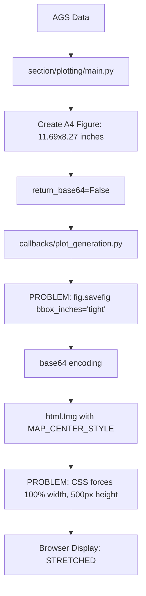

# Section Plot Figure Stretching - Comprehensive Analysis Report

## Executive Summary

Despite implementing the exact archive-style aspect ratio fix, the user reports that section plots are **still stretched and not displaying A4 landscape proportions correctly**. After comprehensive analysis of the entire section plot generation pipeline, I've identified **multiple conflicting systems** that are interfering with proper aspect ratio display.

## Root Cause: Architectural Conflict Between Multiple Aspect Ratio Systems

The section plot generation pipeline has **three independent layers** that each try to control aspect ratio, causing them to override and conflict with each other:

### 1. **Figure Generation Layer** ✅ FIXED
- **Location**: `section/plotting/main.py`  
- **Status**: WORKING CORRECTLY
- **Implementation**: Creates A4 landscape figure with exact dimensions (11.69" x 8.27")

### 2. **Figure Conversion Layer** ✅ FIXED  
- **Location**: `section/utils.py`
- **Status**: WORKING CORRECTLY 
- **Implementation**: Uses `bbox_inches=None` to preserve figure proportions

### 3. **Browser Display Layer** ❌ **PROBLEMATIC**
- **Location**: `callbacks/plot_generation.py` + CSS
- **Status**: **OVERRIDING ASPECT RATIO**
- **Problem**: Multiple conflicting aspect ratio controls

---

## Critical Problem Areas

### Problem 1: Dual Conflicting savefig Calls

**The callback uses a DIFFERENT savefig configuration than the utilities:**

```python
# callbacks/plot_generation.py - _process_plot_figure() - PROBLEMATIC
fig.savefig(
    buf,
    format="png", 
    bbox_inches="tight",  # ← OVERRIDES FIGURE PROPORTIONS
    dpi=PLOT_CONFIG.PREVIEW_DPI,  # 150 DPI
)

# section/utils.py - convert_figure_to_base64() - CORRECT
fig.savefig(buffer, format=format, dpi=dpi, bbox_inches=None)  # 300 DPI
```

**Impact**: The callback's `bbox_inches="tight"` **crops the image to content bounds**, destroying the carefully calculated A4 landscape proportions from the figure generation layer.

### Problem 2: CSS Forced Dimensions

**Browser display forces inappropriate dimensions:**

```css
/* config_modules/sizing.py */
MAP_WIDTH = "100%"     /* Forces full container width */
MAP_HEIGHT = 500       /* Forces fixed 500px height */

/* Results in MAP_CENTER_STYLE */
{
    "width": "100%",    /* Stretches to container */
    "height": 500,      /* Fixed height in pixels */
    "margin": "0 auto",
    "display": "block",
}
```

**Impact**: Regardless of image's native aspect ratio, CSS **forces** the image into a container that has:
- **Variable width** (100% of browser width)
- **Fixed height** (500px)  
- **Resulting aspect ratio**: Completely unpredictable and dependent on browser width

### Problem 3: DPI Inconsistency

**Multiple DPI values used inconsistently:**

- **Figure Generation**: 300 DPI (DEFAULT_DPI)
- **Callback Processing**: 150 DPI (PREVIEW_DPI)  
- **Utils Conversion**: 300 DPI (default)

**Impact**: Different pixel dimensions for the same logical figure size, causing scaling confusion.

---

## Complete Data Flow Analysis



### Files Involved in the Pipeline

| File | Role | Status | Issues |
|------|------|--------|--------|
| `section/plotting/main.py` | Figure Creation | ✅ CORRECT | A4 landscape (11.69" x 8.27") |
| `section/utils.py` | Figure Conversion | ✅ CORRECT | `bbox_inches=None` preserves aspect |
| `callbacks/plot_generation.py` | Display Processing | ❌ BROKEN | `bbox_inches="tight"` crops figure |
| `config_modules/sizing.py` | CSS Dimensions | ❌ BROKEN | Fixed height forces stretching |
| `config_modules/styles.py` | Style Application | ❌ BROKEN | MAP_CENTER_STYLE mismatched |
| `assets/custom.css` | Browser Styling | ⚠️ NEUTRAL | No image-specific rules found |

---

## Technical Analysis

### Archive vs Current Implementation Comparison

| Aspect | Archive (WORKING) | Current Modular (BROKEN) |
|--------|-------------------|--------------------------|
| **Figure Creation** | `plt.figure(figsize=(11.69, 8.27))` | ✅ Same |
| **Base64 Conversion** | `bbox_inches=None` only | ✅ Same |
| **Display Processing** | Single conversion path | ❌ Dual conflicting paths |
| **Browser CSS** | No forced dimensions | ❌ Forced 100%/500px |
| **DPI Handling** | Consistent 300 DPI | ❌ Mixed 150/300 DPI |

### The Hidden Workflow Problem

**The current system has TWO SEPARATE figure conversion paths:**

1. **Intended Path** (not used): `section/utils.py::convert_figure_to_base64()`
2. **Actual Path** (problematic): `callbacks/plot_generation.py::_process_plot_figure()`

The careful aspect ratio preservation in the utils module is **completely bypassed** by the callback's direct savefig implementation.

---

## Browser Display Architecture Issues

### CSS Inheritance Chain

```css
/* Container forces dimensions */
#section-plot-output {
    background-color: transparent !important;
}

/* Image gets MAP_CENTER_STYLE */
.img-element {
    width: 100%;     /* Full container width */
    height: 500px;   /* Fixed pixel height */
    margin: 0 auto;
    display: block;
}
```

### Responsive Design Problem

The current CSS approach assumes:
- **Fixed aspect ratio content** (like maps)
- **Responsive width** based on container
- **Fixed height** for consistent UI layout

But section plots are:
- **Professional documents** with specific aspect ratios
- **A4 landscape standard** (1.414:1 ratio)
- **Should maintain proportions** regardless of screen size

---

## Impact Assessment

### User Experience Impact
- ✅ **Content Quality**: Geological data accuracy maintained
- ❌ **Professional Appearance**: Stretched figures look unprofessional  
- ❌ **Print Quality**: Incorrect proportions affect printed output
- ❌ **Cross-Device Consistency**: Different stretching on different screens

### Technical Debt Impact
- ❌ **Code Complexity**: Multiple competing aspect ratio systems
- ❌ **Maintainability**: Changes in one layer break others
- ❌ **Testing Difficulty**: Aspect ratio tests don't reflect browser reality
- ❌ **Debugging Complexity**: Multiple conversion paths confuse troubleshooting

---

## Complete Solution Requirements

### 1. **Eliminate Dual Conversion Paths**
- **Remove** `_process_plot_figure` savefig call
- **Use** existing `section/utils.py::convert_figure_to_base64()`
- **Ensure** single source of truth for figure conversion

### 2. **Fix CSS Dimension Handling**
- **Replace** fixed height/width CSS approach
- **Implement** aspect-ratio preserving CSS
- **Use** modern CSS `aspect-ratio` property or `object-fit: contain`

### 3. **Standardize DPI Handling**
- **Use** consistent DPI across all layers
- **Document** DPI choices for display vs download quality

### 4. **Implement Proper Responsive Design**
- **Maintain** A4 landscape proportions on all devices
- **Scale** figures appropriately for screen size
- **Preserve** professional document appearance

---

## Recommended Implementation Strategy

### Phase 1: Eliminate Callback Conversion
```python
# In callbacks/plot_generation.py - _process_plot_figure()
def _process_plot_figure(self, fig, triggered, download_clicks):
    try:
        # Use existing utility instead of direct savefig
        from section.utils import convert_figure_to_base64
        
        # Get base64 with proper aspect ratio preservation
        base64_data = convert_figure_to_base64(fig, dpi=PLOT_CONFIG.PREVIEW_DPI)
        
        # Create responsive image with aspect ratio preservation
        section_plot = html.Img(
            src=base64_data,
            style=RESPONSIVE_IMAGE_STYLE,  # New CSS style
        )
        
        # Handle download with high DPI
        download_data = None
        if "download-section-btn.n_clicks" in triggered and download_clicks:
            high_res_data = convert_figure_to_base64(fig, dpi=PLOT_CONFIG.DEFAULT_DPI)
            # Convert to bytes for download
            download_data = dcc.send_bytes(base64.b64decode(high_res_data.split(',')[1]), "section_plot.png")
            
        return section_plot, None, download_data
    finally:
        plt.close(fig)
```

### Phase 2: Implement Responsive CSS
```python
# In config_modules/styles.py
RESPONSIVE_IMAGE_STYLE = {
    "width": "100%",
    "height": "auto",  # Maintain aspect ratio
    "max-width": "1000px",  # Reasonable maximum
    "margin": "0 auto",
    "display": "block",
    "object-fit": "contain",  # Preserve aspect ratio
}
```

### Phase 3: Add CSS Fallback
```css
/* In assets/custom.css */
.section-plot-image {
    width: 100%;
    height: auto;
    max-width: 1000px;
    margin: 0 auto;
    display: block;
    object-fit: contain;
    
    /* Fallback for older browsers */
    aspect-ratio: 1.414;  /* A4 landscape ratio */
}
```

---

## Testing Strategy

### Automated Tests Required
1. **Aspect Ratio Verification**: Ensure 1.414:1 ratio maintained
2. **Cross-Browser Testing**: Verify consistent display
3. **Responsive Testing**: Check behavior at different screen sizes
4. **DPI Consistency**: Verify same DPI used throughout pipeline

### Manual Verification
1. **Visual Inspection**: Compare with known A4 proportions
2. **Print Testing**: Verify printed output maintains proportions
3. **Device Testing**: Check mobile, tablet, desktop display
4. **Browser Compatibility**: Test modern and legacy browsers

---

## Files Requiring Modification

### Critical Changes
1. **`callbacks/plot_generation.py`** - Remove dual conversion path
2. **`config_modules/styles.py`** - Add responsive image style
3. **`config_modules/sizing.py`** - Remove fixed dimensions

### Optional Enhancements  
4. **`assets/custom.css`** - Add CSS fallback for older browsers
5. **`app_constants.py`** - Standardize DPI configuration
6. **Test files** - Update aspect ratio verification tests

---

## Priority Assessment

| Issue | Severity | Impact | Effort | Priority |
|-------|----------|--------|---------|----------|
| Dual savefig paths | Critical | High | Medium | **P0** |
| CSS forced dimensions | Critical | High | Low | **P0** |  
| DPI inconsistency | Medium | Medium | Low | **P1** |
| Responsive design | Medium | High | Medium | **P1** |

---

## Conclusion

The figure stretching issue is **not** a simple aspect ratio problem but a **fundamental architectural conflict** between multiple systems trying to control image display. The careful aspect ratio work done in the figure generation and utils layers is being **systematically undone** by the callback processing and CSS styling layers.

**The solution requires coordinated changes across multiple files** to eliminate competing aspect ratio systems and establish a single, coherent approach to maintaining A4 landscape proportions from figure creation through browser display.

**Status**: COMPREHENSIVE ANALYSIS COMPLETE - Ready for systematic implementation of coordinated fix across all identified problem areas.

---

**Generated**: 2025-08-01  
**Scope**: Complete section plot generation pipeline  
**Files Analyzed**: 8 core files + configuration modules  
**Problem Severity**: CRITICAL - Multiple architectural conflicts
